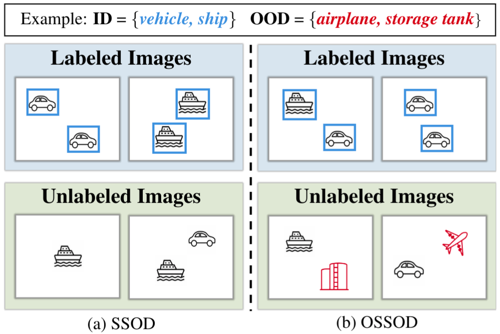
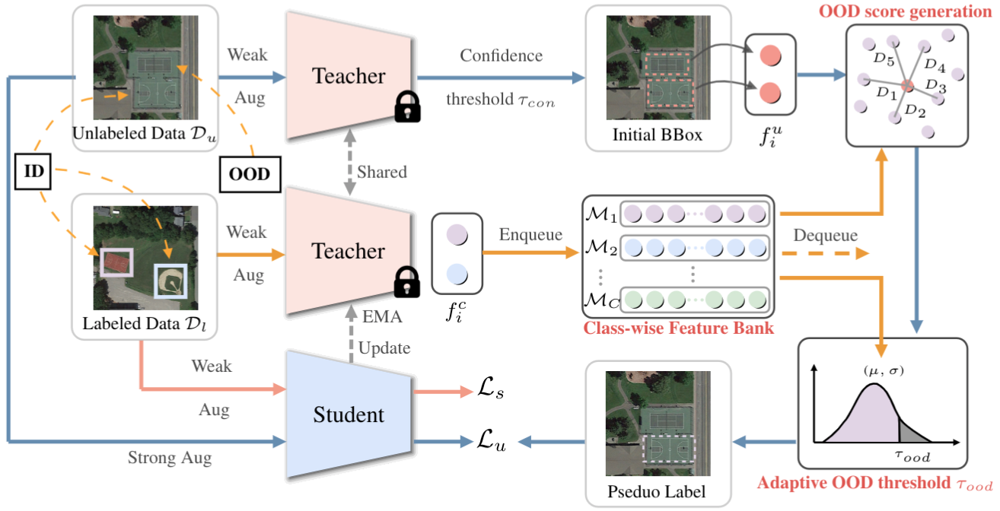

# Semi-Supervised Object Detection with Uncurated Unlabeled Data for Remote Sensing Images

## 🚀 Introduction

<div align="center">
  
</div>

Semi-supervised object detection (SSOD) assumes that both labeled and unlabeled data originate from the same label space, constituting in-distribution (ID) samples. Open-set semi-supervised object detection (OSSOD) accommodates the existence of substantial out-of-distribution (OOD) samples, mirroring the complexities of real-world scenarios. 


## 📻 Overview

<div align="center">
  
</div>

Overview of the proposed open-set semi-supervised object detection (OSSOD) framework. 


## 🎮 Getting Started

### 1. Install Environment
```bash
conda create --name ossod python=3.8
conda activate ossod

pip install torch===1.7.1+cu110 torchvision===0.8.2+cu110 torchaudio===0.7.2 -f https://download.pytorch.org/whl/torch_stable.html --no-cache

git clone https://github.com/Lans1ng/OSSOD.git
cd OSSOD
pip install -r requirements.txt
```


### 2. Prepare Dataset 

- Download the DIOR dataset ([Google Drive](https://drive.google.com/drive/folders/1UdlgHk49iu6WpcJ5467iT-UqNPpx__CC) or [BaiduNetDisk](https://pan.baidu.com/s/1iLKT0JQoKXEJTGNxt5lSMg#list/path=%2F))

- Organize the dataset as follow:

  ```shell
  dataset/
  	└── DIOR/
            ├── annotations_json_split1.json
            ├── annotations_json_split2.json
            └── JPEGImages
                  ├── 00001.jpg
                  ├── 00002.jpg
                  ├── ...
                  └── 23463.jpg
  ```
  - `JPEGImages` represents all images in DIOR dataset
  - Annotations for split1 and split2 are already included in the repo.

### 3. Download Checkpoints

Before training，please download the pretrained backbone ([ResNet-50](https://download.pytorch.org/models/resnet50-19c8e357.pth)) to `pretrained_model/backbone`.


### 4. Training
Take split1 of the DIOR dataset as examples:
- Use in-distribution (ID) labeled data to train a baseline

```bash
python train.py --config configs/baseline/baseline_ssod_split1.py --work-dir work_dirs/split1/baseline_ssod --base_stage True
```
- Use unlabeled data to train semi-supervised detector:

  - Train detectors with ID unlabeled data

  ```bash
  #unbiased teacher
  python train.py --config configs/unbiased_teacher/split1/unbiased_teacher_id.py --work-dir work_dirs/split1/unbiased_teacher_ID 

  #our proposed ossod
  python train.py --config configs/unbiased_teacher/split1/unbiased_teacher_ossod_id.py --work-dir work_dirs/split1/unbiased_teacher_ossod_ID
  ```

  - Train detectors with ID and mixed unlabeled data
  ```bash
  #unbiased teacher
  python train.py --config configs/unbiased_teacher/split1/unbiased_teacher_id_mix.py --work-dir work_dirs/split1/unbiased_teacher_ID_MIX 

  #our proposed ossod
  python train.py --config configs/unbiased_teacher/split1/unbiased_teacher_ossod_id_mix.py --work-dir work_dirs/split1/unbiased_teacher_ossod_ID_MIX
  ```

    
  - Train detectors with ID, mixed and out-of-distribution (OOD) unlabeled data
  ```bash
  #unbiased teacher
  python train.py --config configs/unbiased_teacher/split1/unbiased_teacher_id_mix_ood.py --work-dir work_dirs/split1/unbiased_teacher_ID_MIX_OOD 

  #our proposed ossod
  python train.py --config configs/unbiased_teacher/split1/unbiased_teacher_ossod_id_mix_ood.py --work-dir work_dirs/split1/unbiased_teacher_ossod_ID_MIX_OOD
  ```
### 5. Testing
Take split1 of the DIOR dataset as examples:
```bash
python eval.py --config configs/unbiased_teacher/split1/unbiased_teacher_ossod_id_mix_ood.py --checkpoint work_dirs/split1/unbiased_teacher_ossod_ID_MIX_OODlatest.pth --eval mAP  --show-dir results
```

<!-- 
## 🎫 License

The content of this project itself is licensed under [LICENSE](LICENSE). -->

## 💡 Acknowledgement

- [mmdetection](https://github.com/open-mmlab/mmdetection)
- [SSOD](https://github.com/hikvision-research/SSOD)
- [OWOD](https://github.com/JosephKJ/OWOD)


## 🖊️ Citation

If you find this project useful in your research, please consider cite:

```BibTeX
@article{liu2024semi,
  title={Semi-Supervised Object Detection with Uncurated Unlabeled Data for Remote Sensing Images},
  author={Liu, Nanqing and Xu, Xun and Gao, Yingjie and Zhao, Yitao and Li, Heng-Chao},
  journal={International Journal of Applied Earth Observation and Geoinformation},
  year={2024}
}
```